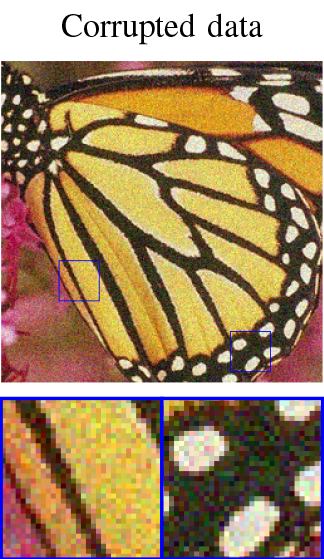

# ADMM DIP-TV: combining Total Variation and Deep Image Prior for image restoration

### [Paper (arXiv)](https://arxiv.org/abs/2009.11380) | [Paper (ResearchGate)](https://www.researchgate.net/publication/344371742_ADMM-DIPTV_combining_Total_Variation_and_Deep_Image_Prior_for_image_restoration)

# Abstract
In the last decades, unsupervised deep learning based methods have caught researchers attention, since in many applications collecting a great amount of training examples is not always feasible. Moreover, the construction of a good training set is time consuming and hard because the selected data have to be enough representative for the task. In this paper, we mainly focus on the Deep Image Prior (DIP) framework powered by adding the  Total Variation regularizer which promotes the gradient-sparsity. Differently from other existing approaches, we solve the arising minimization problem by using the well known Alternating Direction Method of Multipliers (ADMM) framework, decoupling the contribution of the DIP L₂-norm and Total Variation terms. The promising performances of the proposed approach, in terms of PSNR and SSIM values, are addressed by means of experiments for different image restoration tasks on synthetic as well as on real data. 

## Image Denoising
 

## Credits
The code of this paper is built upon the [Deep Image Prior](https://github.com/DmitryUlyanov/deep-image-prior) repository created by Dimitry Ulyanov et al.
# Citing
Please consider to cite ADMM-DIPTV if you find it helpful.

```BibTex
 @article{cascarano2020admm,
  title={ADMM-DIPTV: combining Total Variation and Deep Image Prior for image restoration},
  author={Cascarano, Pasquale and Sebastiani, Andrea and Comes, Maria Colomba},
  journal={arXiv preprint arXiv:2009.11380},
  year={2020}
}
 ```
