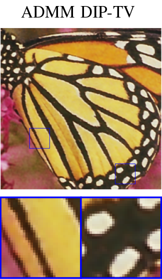

# Combining Weighted Total Variation and Deep Image Prior for natural and medical image restoration via ADMM

### [Paper (arXiv)](https://arxiv.org/abs/2009.11380) | [Paper (ResearchGate)](https://www.researchgate.net/publication/344371742_Combining_Weighted_Total_Variation_and_Deep_Image_Prior_for_natural_and_medical_image_restoration_via_ADMM)

# Abstract
In the last decades, unsupervised deep learning based methods have caught researchers attention, since in many real applications, such as medical imaging, collecting a great amount of training examples is not always feasible. Moreover, the construction of a good training set is time consuming and hard because the selected data have to be enough representative for the task. In this paper, we focus on the Deep Image Prior (DIP) framework and we propose to combine it with a space-variant Total Variation regularizer with an automatic estimation of the local regularization parameters. Differently from other existing approaches, we solve the arising minimization problem via the flexible Alternating Direction Method of Multipliers (ADMM). Furthermore, we provide a specific implementation also for the standard isotropic Total Variation. The promising performances of the proposed approach, in terms of PSNR and SSIM values, are addressed through several experiments on simulated as well as real natural and medical corrupted images.

## Image Denoising


## CT enhancement


## Credits
The code of this paper is built upon the [Deep Image Prior](https://github.com/DmitryUlyanov/deep-image-prior) repository created by Dimitry Ulyanov et al.
# Citing
Please consider to cite ADMM-DIPTV if you find it helpful.

```BibTex
@inproceedings{cascarano2021combining,
  title={Combining weighted total variation and deep image prior for natural and medical image restoration via ADMM},
  author={Cascarano, Pasquale and Sebastiani, Andrea and Comes, Maria Colomba and Franchini, Giorgia and Porta, Federica},
  booktitle={2021 21st International Conference on Computational Science and Its Applications (ICCSA)},
  pages={39--46},
  year={2021},
  organization={IEEE}
}
 ```
